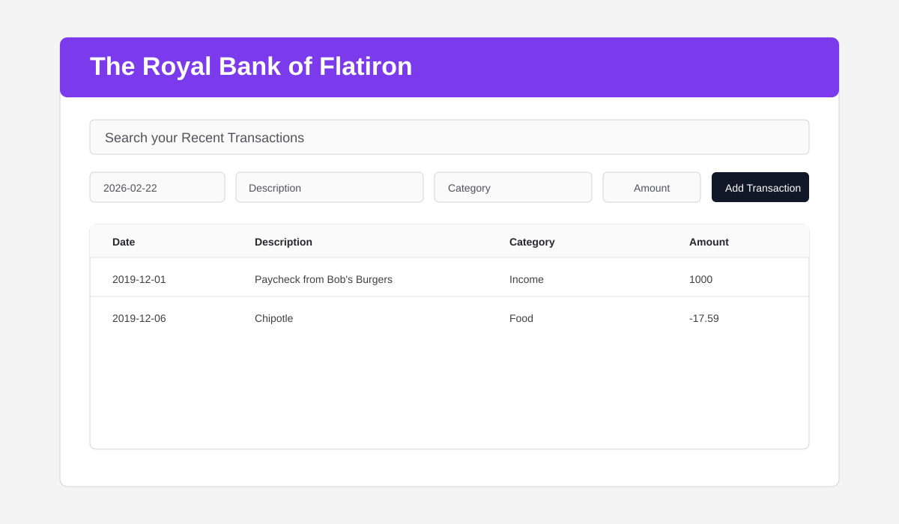

# React Testing Lab

A small banking transaction tracker built with React and tested with Vitest + Testing Library.

## Project Features

- Display transactions on startup by fetching from a local API.
- Add new transactions from a form and persist them with a POST request.
- Search transactions by description or category.
- Sort transactions by description or category.
- Validate core behaviors with a focused automated test suite.

## Screenshot



## Tech Stack

- React 19
- Vite 6
- Vitest 3
- Testing Library (`@testing-library/react`, `@testing-library/user-event`, `@testing-library/jest-dom`)
- json-server

## Getting Started

### Prerequisites

- Node.js 18+
- npm

### Installation

```sh
npm install
```

### Run the App

Start frontend:

```sh
npm run dev
```

Start backend (json-server on port 6001):

```sh
npm run server
```

## Available Scripts

- `npm run dev` — starts Vite dev server.
- `npm run server` — starts json-server with `db.json`.
- `npm test` — runs Vitest.

## Testing Coverage

The suite includes tests for:

- Transactions render on initial load.
- New transaction submission updates the UI.
- Transaction submission triggers a POST request.
- Search input change filters displayed transactions.
- Sort change updates transaction order.

## Project Structure

- `src/components` — UI components and container logic.
- `src/__tests__` — test setup and test suites.
- `db.json` — local transaction data used by json-server.

## Notes for Contributors

- Keep business logic in container-level components.
- Prefer test-driven updates for user-facing behavior changes.
- Use meaningful commit messages and short-lived feature branches.

